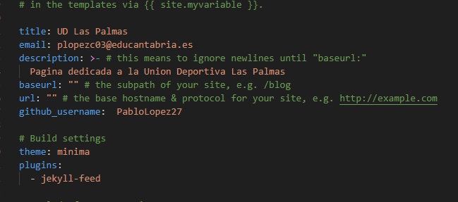
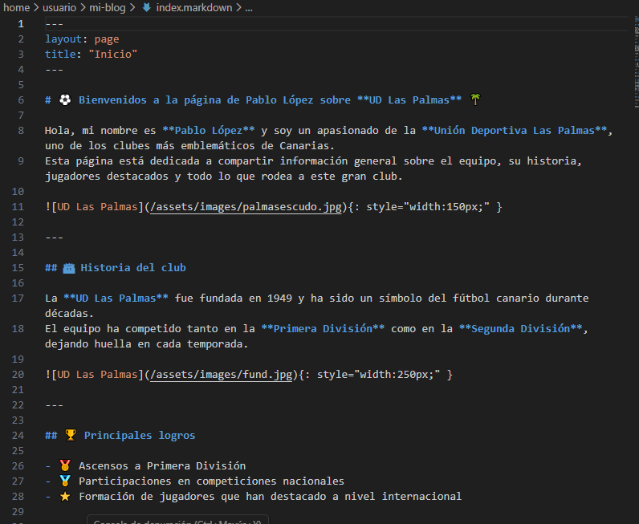
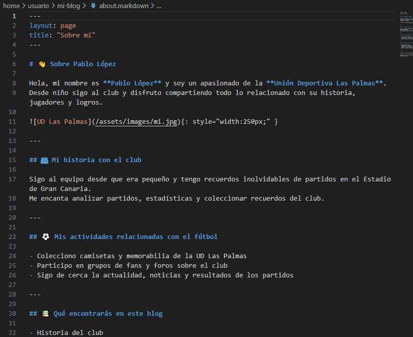
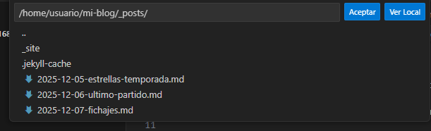
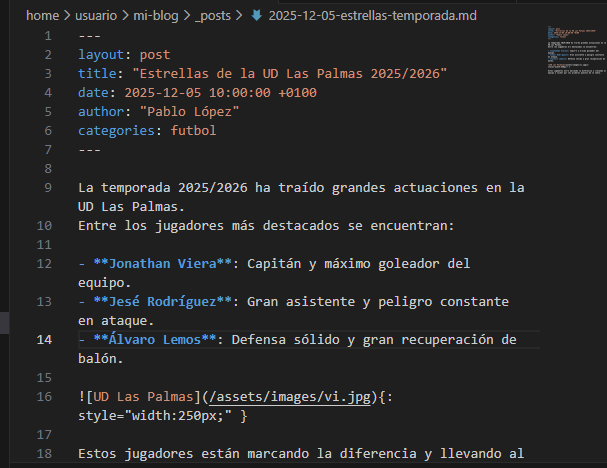
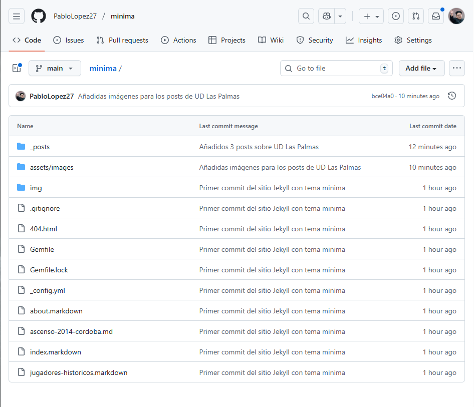

# Ejercicio 1: Creación de un sitio web en Jekyll con el tema Minima

## 1. Instalación de Jekyll en Debian 13
### 1.1. Actualización del sistema
`sudo apt update && sudo apt upgrade -y`

### 1.2. Instalación de Ruby y dependencias

Jekyll requiere Ruby. Instalamos Ruby, Bundler y herramientas esenciales.

`sudo apt install ruby-full build-essential zlib1g-dev -y`

### 1.3. Configuración recomendada del entorno

Para evitar instalaciones globales de gemas:

`echo 'export GEM_HOME="$HOME/gems"' >> ~/.bashrc`
`echo 'export PATH="$HOME/gems/bin:$PATH"' >> ~/.bashrc`
`source ~/.bashrc`

### 1.4. Instalación de Jekyll y Bundler
`gem install jekyll bundler`

# 2.Creación del sitio Jekyll
## 2.1. Crear un nuevo sitio

`jekyll new mi-blog`

# 3. Crear el repositorio en git:
Primero hay que crear el repositorio en local con Git mediante los comandos:

`git init`
`git remote add origin "https://github.com/PabloLopez27/minima.git"`

Creamos el repositorio en GitHub:

# 4. Configuración del sitio

Editamos el archivo _config.yml.

## 4.1. Modificación de pares clave/valor

# 5. Personalización de páginas
## 5.1. Modificación de index.markdown

## 5.2. Modificación de about.markdown

# 6. Creación de publicaciones (posts)

Creamos tres archivos en _posts/:

## 6.1. Ejemplo Post 

# 7. Subir el proyecto

Desde la carpeta mi-blog:

`git init
git add .
git commit -m "Versión inicial del blog Jekyll con tema minima"
git branch -M main
git remote add origin https://github.com/PabloLopez27.github.io
git push -u origin main`

Tendría que quedar así:

# 8. Sitio Web
Inicio del sitio web:
https://pablolopez27.github.io/minima/

