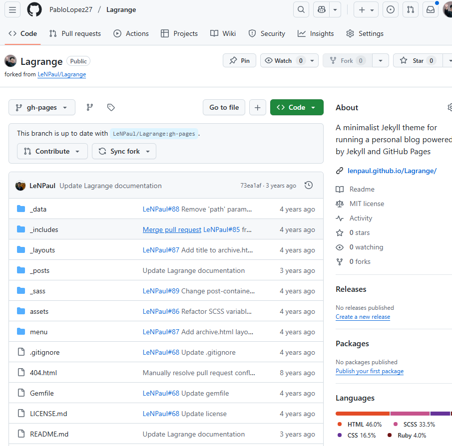
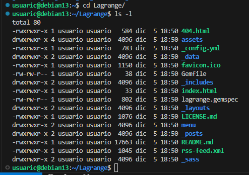
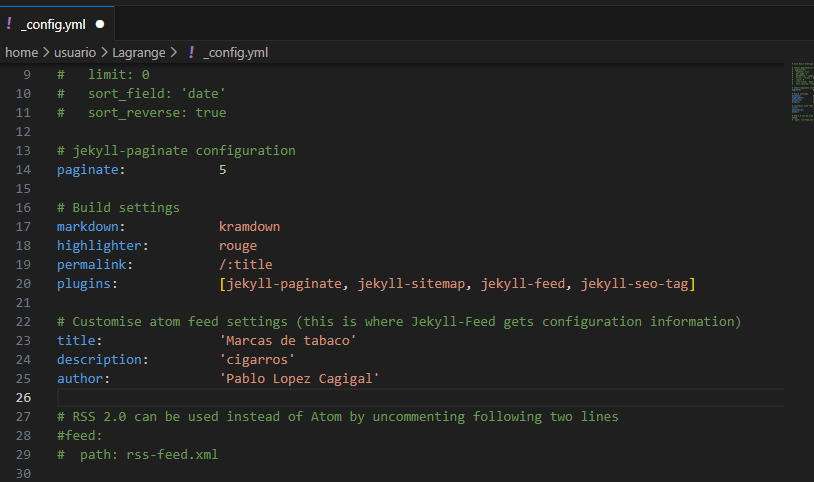
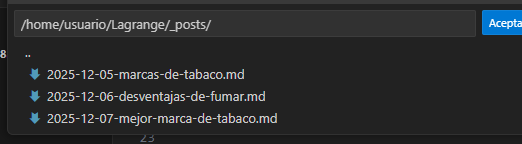
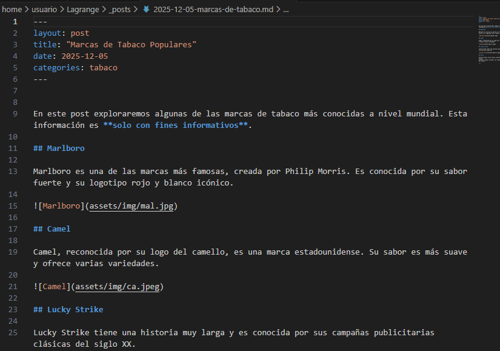
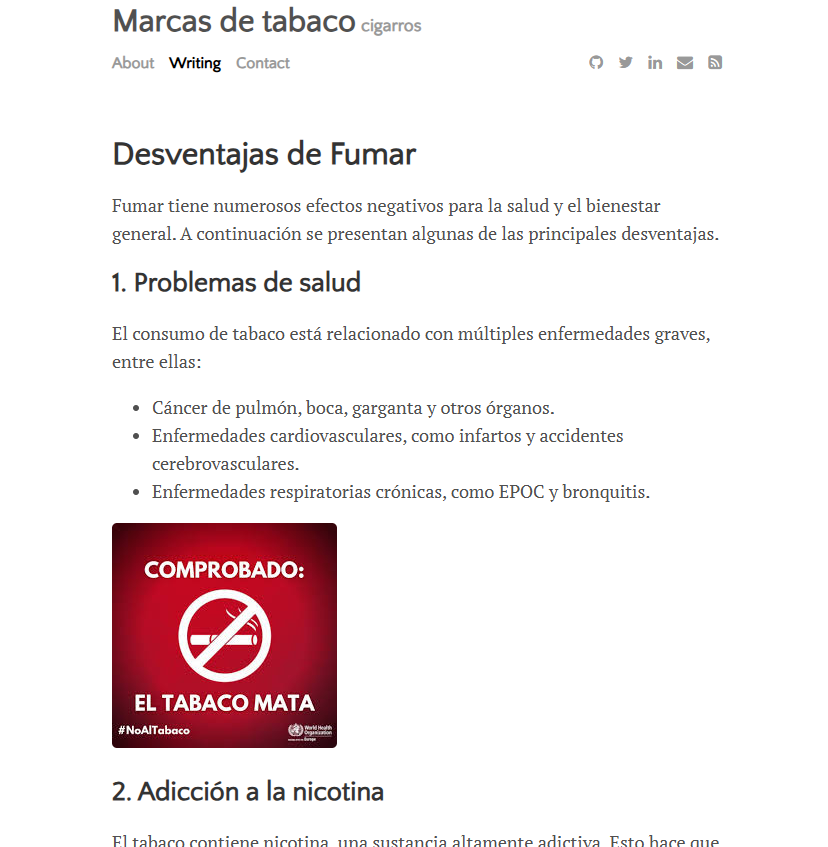
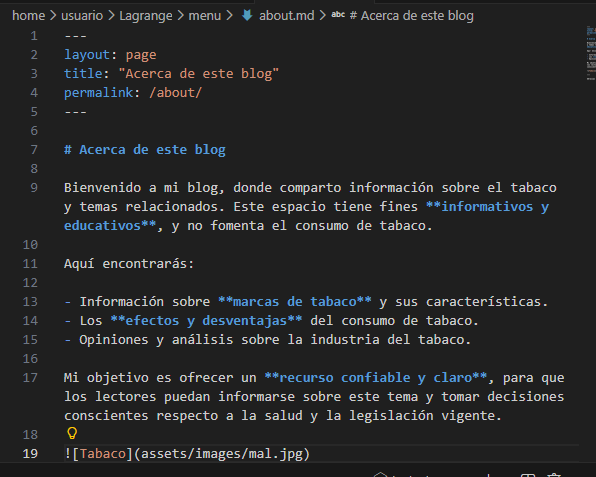
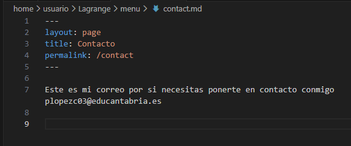
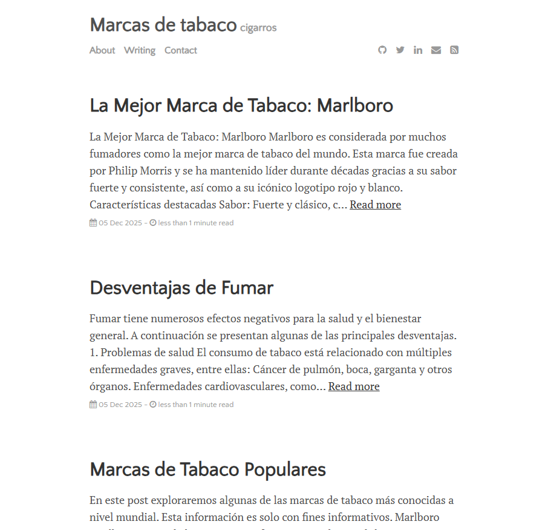

# Ejercicio 2: Creación de un sitio web en Jekyll con el tema Lagrange

## 1. Hacemos un fork para obtener el tema de lagrange y poder utiizarlo en nuestro repositorio

### Clonamos el repositorio local con este comando:
`git clone https://github.com/PabloLopez27/Lagrange.git`

## 2. Configuracion del sitio

### 2.1. config_yml

### 2.2 Creacion de los posts:

### 2.3 Estructura de los posts:
tiene que tener este formato de nombre los archivos: año-mes-dia-nombre_del_post 
y tienen que tener esta estructura:

### 2.4 Ejemplo de post:

### 2.5 Pagina Acerca de:
la informacion se cambia en el archivo about.md dentro de la carpeta menu

### 2.6 Pagina contacto:
se encuentra en la misma carpeta que la anterior

## 3. Subida a GitHub
subimos los cambios con los siguientes comandos:
`git add .
git commit -m "comentario"`

Para subirlo a GH-pages hay que subirlo desde esa rama con este comando:

`git push origin gh-pages`

## 4. Sitio web subido
https://pablolopez27.github.io/Lagrange/

