# Ejercicio 3: Elegir un tema de Jekyll y desplegar el sitio en Netlify

## 1. Obtener el tema de jekyll y hacer el fork:

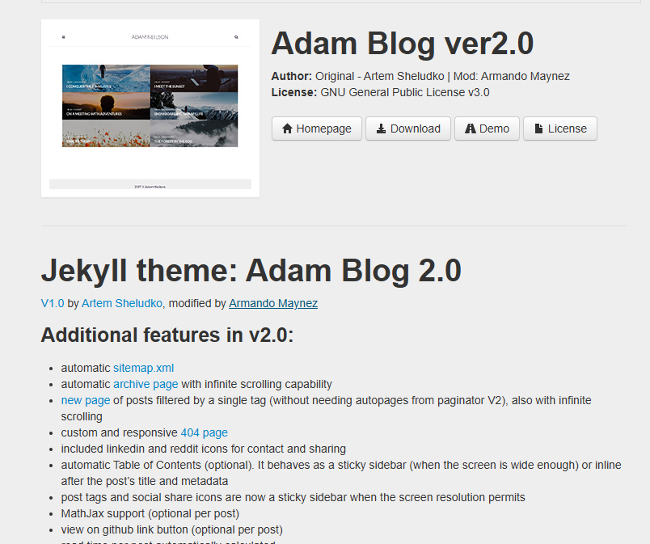
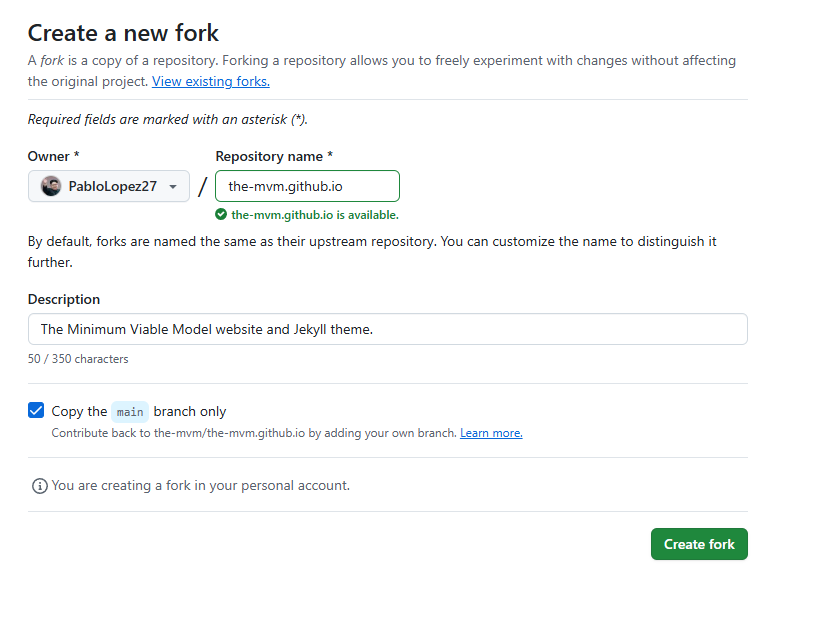

## 2. Clonamos el repositorio en local:
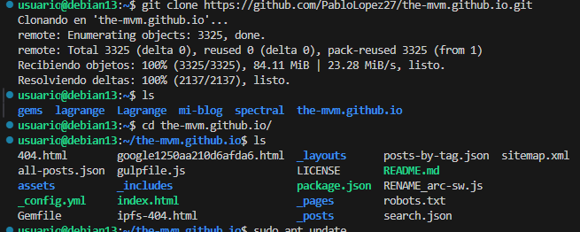

## 3. Configuracion _config.yml:
Aquipodemos personalizar el sitio poniendo nuestro correo y mas cosas sobre nosotros
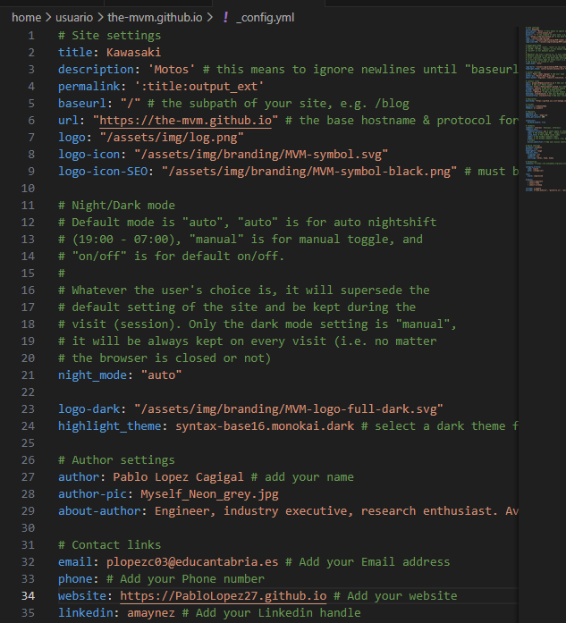

## 4. Configuracion del sitio:
### 4.1. Configuracion de index.html:
configuramos el sitio en este fichero ya que en los demas ficheros no hay que tocar nada:
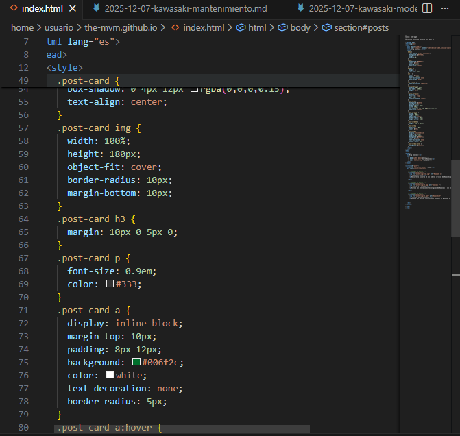
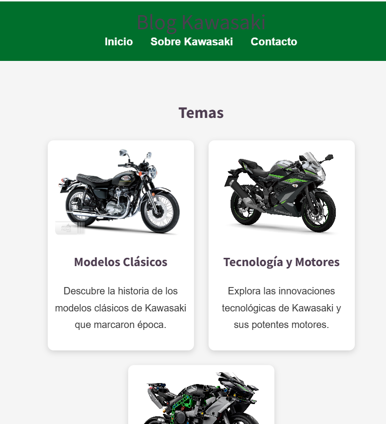

### 4.2. Configuracion de 404.hmtl:
este archivo sirva para sacarnos por pantalla una pagina de error si entramos a un enlace y no tiene salida por lo cual no lo tocamos
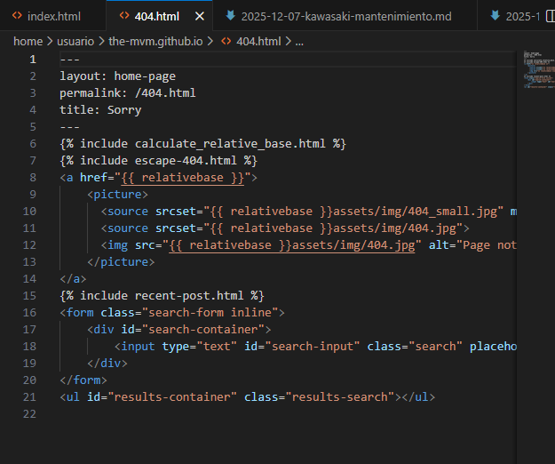

#### Los demas ficheros que serian estos 2 también les dejariamos como están:
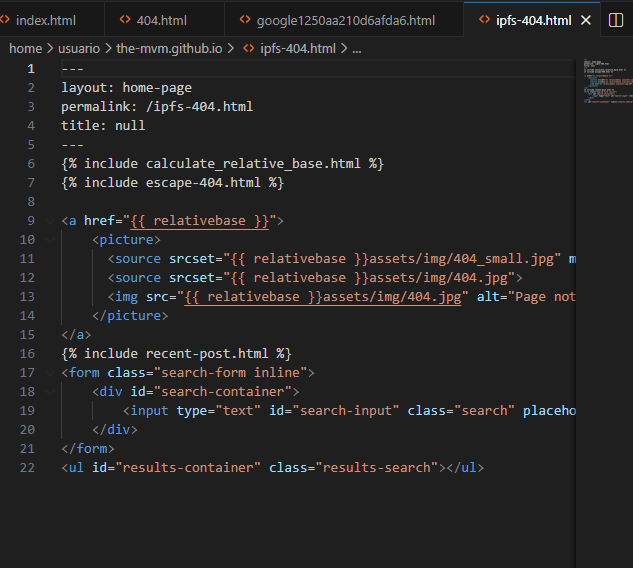
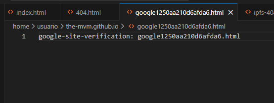

### 4.2. Configuracion Posts:
Los posts tienen que tener esta estructura: año-mes-dia-nombre_del_post
uno de ellos por ejemplo es este:
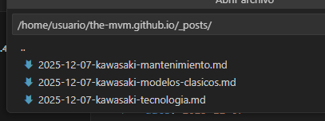

## 5. Subimos el archivo a GitHub
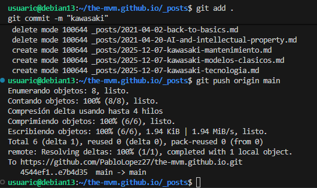

## 5. Desplegar el sitio en Netlify
### Lo primero que hay que hacer es iniciar sesion en Netlify con nuestro usuario de GitHub
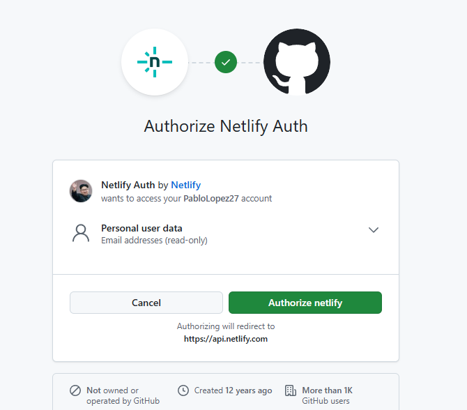

### Ahora creamos el proyecto y selecionamos nuestro repositorio
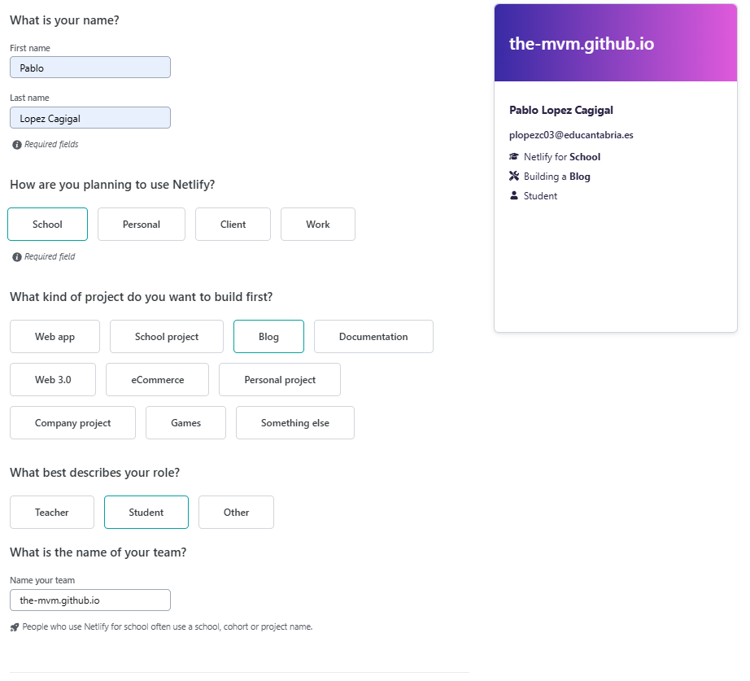
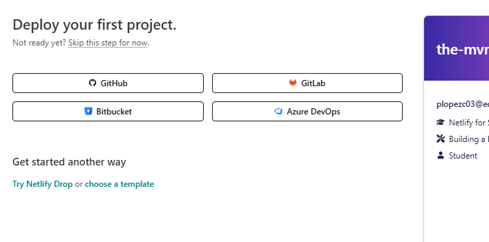

### Desplegamos el sitio y esperamos a que se despliegue
el sitio da error al deslplegarse:
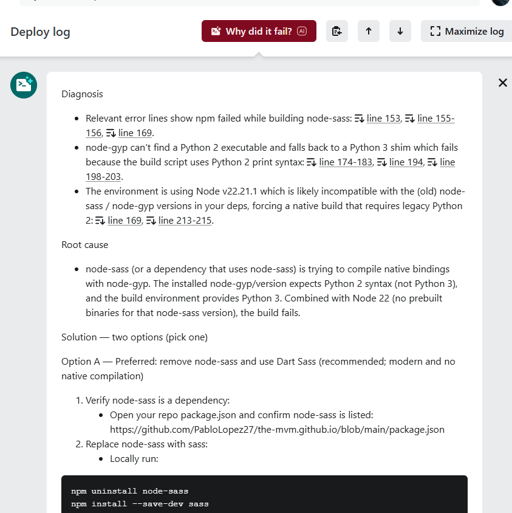
